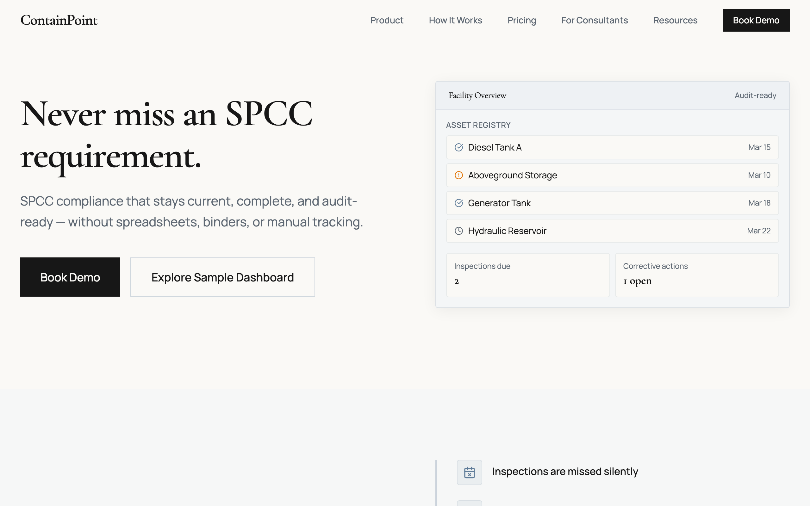
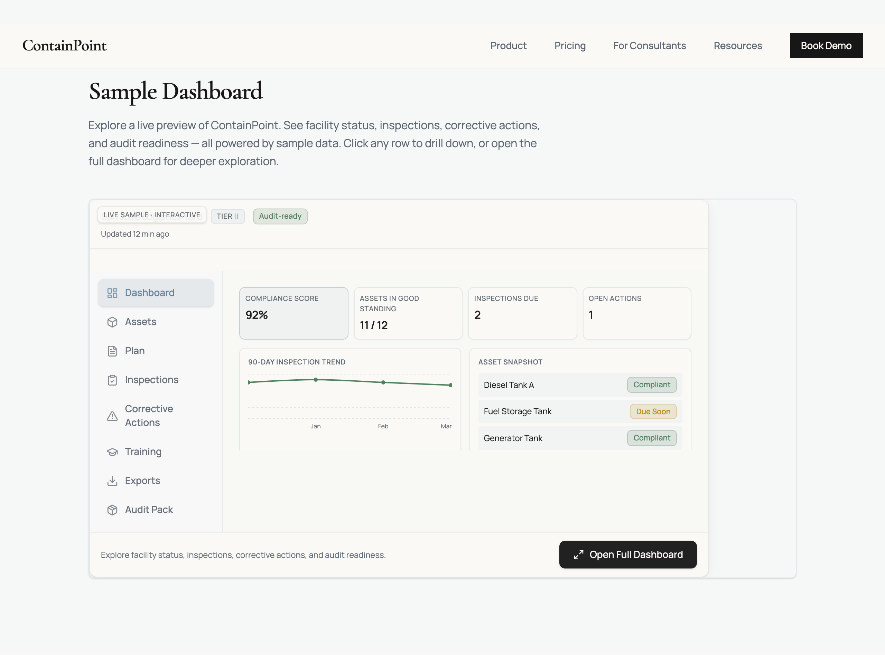
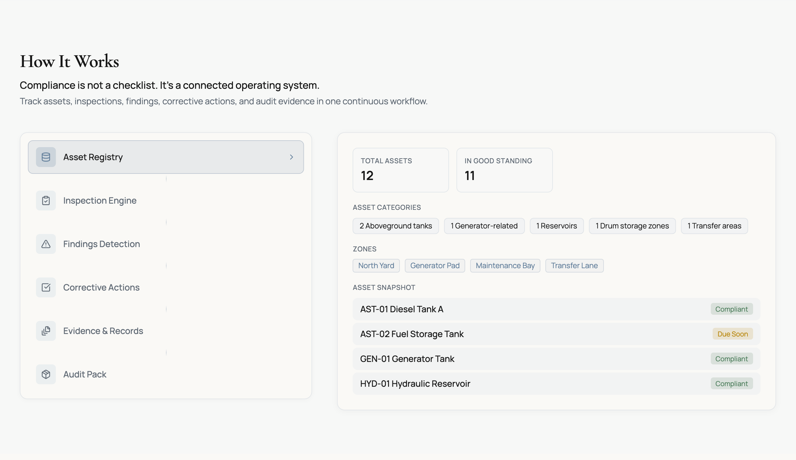
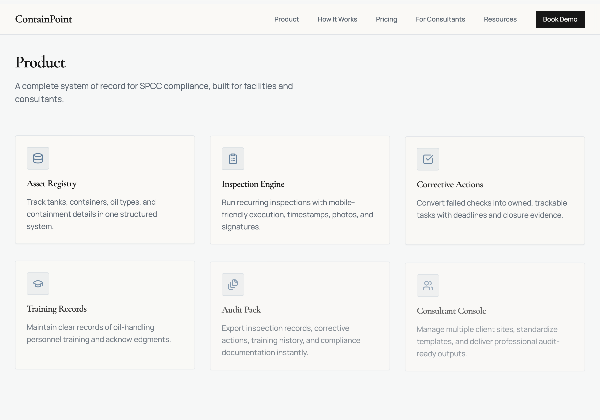

# ContainPoint

**SPCC compliance that stays current, complete, and audit-ready.**

ContainPoint is a compliance infrastructure platform built for facilities managing SPCC (Spill Prevention, Control, and Countermeasure) obligations. It replaces spreadsheets, binders, and fragmented workflows with a single system that tracks inspections, manages corrective actions, and generates audit-ready documentation instantly.



---

## Overview

Most facilities don't struggle with understanding SPCC rules—they struggle with execution. Inspections are missed silently. Records scatter across Excel, email, and paper. Corrective actions fall through the cracks. Audits become multi-day scrambles.

ContainPoint makes compliance operational:

- **Asset Registry** — Track every tank, container, oil type, and containment detail in one structured system
- **Inspection Engine** — Run recurring inspections with mobile-friendly execution, timestamps, photos, and signatures
- **Corrective Actions** — Convert failed checks into owned, trackable tasks with deadlines and closure evidence
- **Audit Pack** — Export inspection records, corrective actions, training history, and compliance documentation instantly
- **Consultant Console** — Manage multiple client sites, standardize templates, and deliver professional audit-ready outputs

---

## Product Preview

### Sample Dashboard

Explore a live preview of ContainPoint with sample facility data. See facility status, inspections, corrective actions, and audit readiness in action. Click any row to drill down, or open the full dashboard for deeper exploration.



### How It Works

A connected operating system—not a checklist. Track assets, inspections, findings, corrective actions, and audit evidence in one continuous workflow.



### Product Modules

A complete system of record for SPCC compliance, built for facilities and consultants.



---

## Built For

- **Regulated facilities** — Trucking depots, manufacturing plants, equipment yards, farms, data centers
- **Environmental consultants** — Multi-site management, standardized templates, client-ready exports
- **Compliance teams** — Structured inspection tracking, corrective action management, audit readiness

---

## Tech Stack

- **React 18** + TypeScript
- **Vite** for build tooling
- **Tailwind CSS v4** for styling
- **Framer Motion** for animations
- **Recharts** for charts and data visualization
- **React PDF** for audit pack export

---

## Getting Started

### Prerequisites

- Node.js 18+
- npm or yarn

### Install

```bash
npm install
```

### Development

```bash
npm run dev
```

Open [http://localhost:5173](http://localhost:5173) in your browser.

### Build

```bash
npm run build
```

### Preview Production Build

```bash
npm run preview
```

### Capture Screenshots

Regenerate README screenshots after design changes:

```bash
npm run screenshots
```

---

## Deploy to Vercel

1. Push to GitHub and connect the repo in [Vercel](https://vercel.com).
2. Add the environment variable:
   - `VITE_FORMSPREE_FORM_ID` — Your Formspree form ID from [formspree.io](https://formspree.io)
3. Deploy. Vercel will detect Vite and build automatically.

---

## Project Structure

```
src/
├── components/          # React components
│   ├── dashboard/       # Interactive dashboard (sample audit, tabs, PDF)
│   ├── mocks/           # Hero preview mock
│   ├── sections/        # Landing page sections
│   └── ui/              # Shared UI primitives
├── data/                # Sample dashboard data (dynamic dates)
├── lib/                 # Utilities (date helpers, cn)
└── main.tsx
```

---

## License

Proprietary. All rights reserved.

---

**ContainPoint** — Never miss an SPCC requirement.
